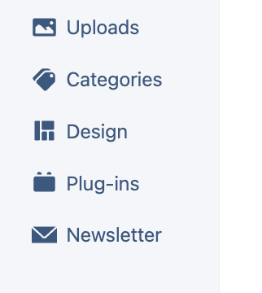
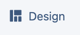
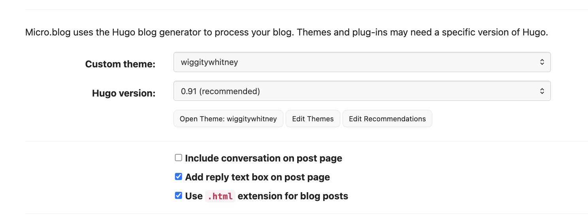
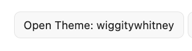
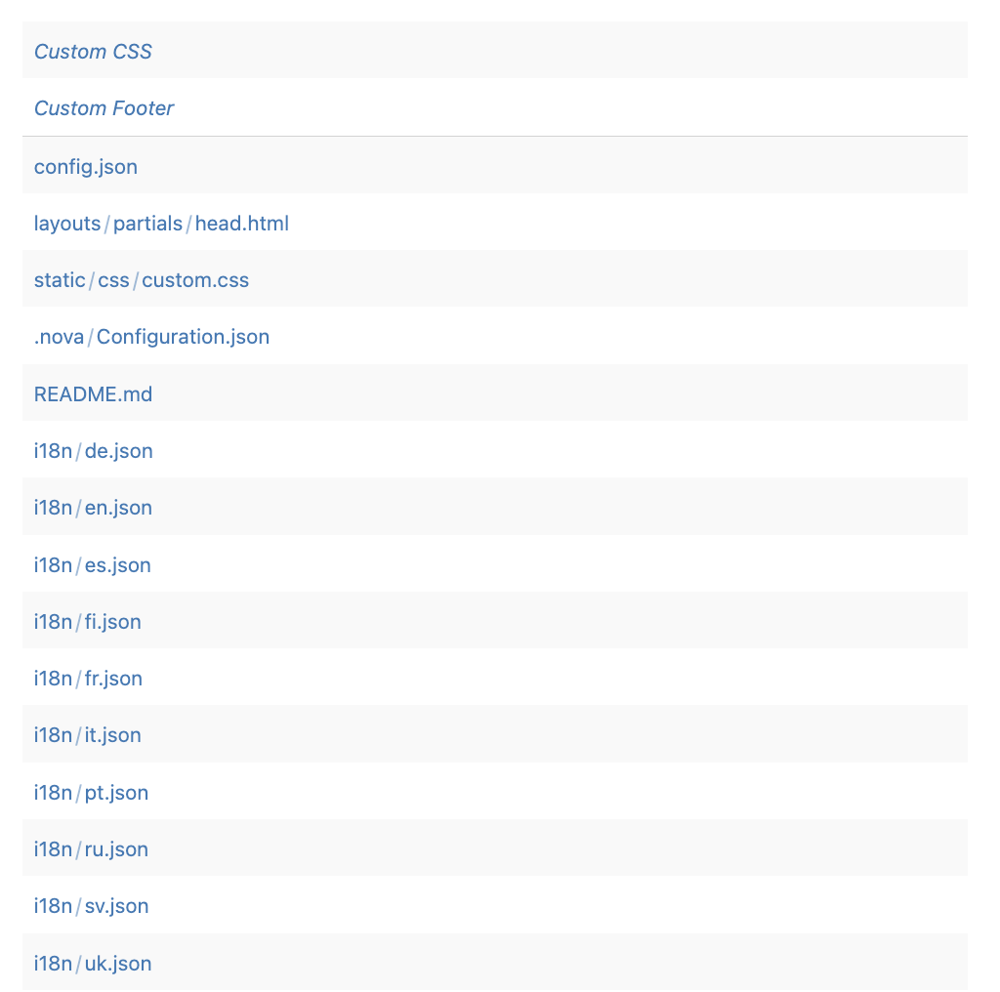
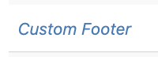
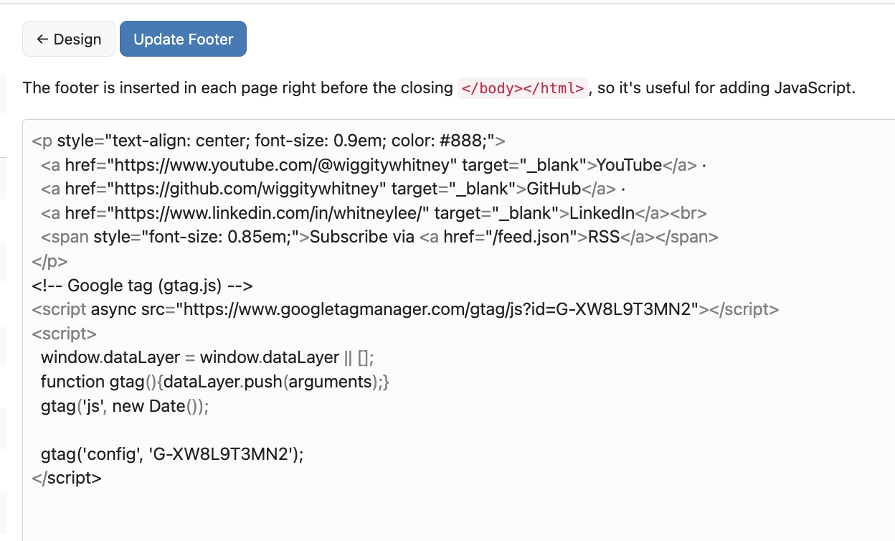

# Google Analytics Setup for Micro.blog

**Status**: Complete ✅
**Date**: October 24, 2025
**Property**: whitneylee.com
**Measurement ID**: G-XW8L9T3MN2

---

## Overview

This document covers the complete setup process for Google Analytics 4 (GA4) tracking on the Micro.blog site (whitneylee.com).

## Setup Summary

### What Was Accomplished
1. ✅ Created Google Analytics account
2. ✅ Configured GA4 property for whitneylee.com
3. ✅ Set up web data stream
4. ✅ Added tracking code to Micro.blog custom footer
5. ✅ Verified tracking code is working correctly

### Configuration Details

**Account Information:**
- Account Name: Whitney Lee Personal
- Property Name: whitneylee.com
- Time Zone: (GMT-07:00) Los Angeles Time
- Currency: US Dollar ($)

**Property Settings:**
- Industry Category: Arts & Entertainment
- Business Size: Small (1-10 employees)
- Business Objectives:
  - Understand web and/or app traffic
  - View user engagement & retention

**Data Stream:**
- Stream Name: whitneylee.com
- Stream URL: https://whitneylee.com
- Stream ID: 12339863568
- Measurement ID: G-XW8L9T3MN2

**Enhanced Measurement:** ✅ Enabled
- Page views
- Scrolls
- Outbound clicks
- Plus 4 more automatic events

---

## Step-by-Step Setup Process

### 1. Google Analytics Account Creation

1. Navigated to https://analytics.google.com
2. Clicked "Start measuring"
3. Created account with name "Whitney Lee Personal"
4. Accepted data sharing settings:
   - ✅ Modeling contributions & business insights
   - ✅ Technical support
   - ✅ Recommendations for your business

### 2. Property Creation

1. Property name: whitneylee.com
2. Selected reporting timezone: Los Angeles (GMT-07:00)
3. Selected currency: US Dollar ($)

### 3. Business Details

1. Industry category: Arts & Entertainment
2. Business size: Small (1-10 employees)

### 4. Business Objectives

Selected objectives:
- Understand web and/or app traffic
- View user engagement & retention

### 5. Data Collection Setup

1. Chose platform: **Web**
2. Configured web stream:
   - Website URL: https://whitneylee.com
   - Stream name: whitneylee.com
   - Enhanced measurement: Enabled (default)

### 6. Tracking Code Installation

This section provides detailed step-by-step instructions for adding the Google Analytics tracking code to your Micro.blog site's custom footer.

#### Step 6.1: Navigate to Posts → Design

1. From the Micro.blog sidebar, locate the **Design** option

   

2. Click on **Design** to open the Design section

   

#### Step 6.2: Open Your Custom Theme

1. You'll see the Design page with your theme settings:
   - Custom theme name (e.g., "wiggitywhitney")
   - Hugo version
   - Theme customization options

   

2. Click the **"Open Theme: [your-theme-name]"** button to access your theme files

   

#### Step 6.3: Locate the Custom Footer File

1. You'll see a list of theme files including:
   - Custom CSS
   - **Custom Footer** ← This is what we need!
   - config.json
   - layouts/partials/head.html
   - And other theme files

   

2. Click on **Custom Footer** to open the footer editor

   

#### Step 6.4: Add the Google Analytics Tracking Code

1. The Custom Footer editor will open. You'll see:
   - A helpful note: "The footer is inserted in each page right before the closing `</body></html>`, so it's useful for adding JavaScript."
   - A text area where you can add your custom footer code
   - An **"Update Footer"** button to save your changes

   

2. In the footer text area, paste your Google Analytics tracking code:

   ```html
   <!-- Google tag (gtag.js) -->
   <script async src="https://www.googletagmanager.com/gtag/js?id=G-XW8L9T3MN2"></script>
   <script>
     window.dataLayer = window.dataLayer || [];
     function gtag(){dataLayer.push(arguments);}
     gtag('js', new Date());

     gtag('config', 'G-XW8L9T3MN2');
   </script>
   ```

   **Important Notes:**
   - Replace `G-XW8L9T3MN2` with your own Measurement ID (obtained from Google Analytics)
   - The code can be added before or after any existing footer content
   - Make sure to paste the code exactly as provided by Google Analytics

3. Click **"Update Footer"** to save your changes

4. The tracking code will now be included on every page of your Micro.blog site, right before the closing `</body></html>` tags

#### Why the Custom Footer Works for Analytics

The Custom Footer is ideal for tracking codes because:
- It loads on every page of your site automatically
- It's positioned at the end of the page (before `</body>`), which doesn't block initial page rendering
- Changes to the footer are immediately applied across your entire site
- No need to manually edit theme HTML files

### 7. Verification

**Method:** Google Analytics Tag Assistant

**Result:** ✅ "Your Google tag was correctly detected on your website."

**Timeline:** Data collection may take up to 48 hours to begin showing in reports.

---

## Screenshots

All setup screenshots are available in `/docs/images/google-analytics/`:

### Google Analytics Account Setup
Screenshots of the Google Analytics account creation process (to be added):

1. `01-welcome-screen.png` - Initial GA welcome screen
2. `02-account-creation.png` - Account creation form
3. `03-property-creation.png` - Property setup with whitneylee.com
4. `04-business-details.png` - Industry and business size selection
5. `05-business-objectives.png` - Selected analytics objectives
6. `06-data-collection-platform.png` - Platform selection (Web)
7. `07-web-stream-setup.png` - Web stream configuration
8. `08-tracking-code.png` - Generated tracking code
9. `09-tag-verification-success.png` - Successful tag detection
10. `10-web-stream-details.png` - Complete stream configuration
11. `11-data-collection-dashboard.png` - Data collection status

### Micro.blog Installation Steps
Screenshots showing how to add tracking code to Micro.blog custom footer:

1. `microblog-setup/01-posts-sidebar-design.png` - Micro.blog sidebar showing Design option
2. `microblog-setup/02-design-selected.png` - Design option selected in sidebar
3. `microblog-setup/03-design-page-theme-options.png` - Design page showing theme options
4. `microblog-setup/04-open-theme-button.png` - Open Theme button highlighted
5. `microblog-setup/05-theme-files-list.png` - Theme files list showing Custom Footer
6. `microblog-setup/06-custom-footer-selected.png` - Custom Footer selected
7. `microblog-setup/07-custom-footer-editor-with-code.png` - Custom Footer editor with tracking code

---

## Accessing Analytics

**Dashboard:** https://analytics.google.com

**Navigation:**
1. Select "Whitney Lee Personal" account (if you have multiple accounts)
2. Select "whitneylee.com" property
3. View reports in the left sidebar:
   - Reports → Realtime (see live visitors)
   - Reports → Life cycle → Acquisition (traffic sources)
   - Reports → Life cycle → Engagement (page views, events)

---

## Security Considerations

### Measurement ID Visibility
- The Measurement ID (G-XW8L9T3MN2) is **public** and visible in the HTML source of whitneylee.com
- This is by design - it allows sending data TO Google Analytics
- It does NOT grant access to view analytics data or your Google account

### Domain Restrictions (Optional - Future Enhancement)
While the tracking code is public, you can configure additional protections:

**Option 1: Configure Your Domains**
- Go to: Admin → Data Streams → whitneylee.com → Configure tag settings
- Configure cross-domain settings to mark whitneylee.com as your legitimate domain

**Option 2: Data Filters**
- Go to: Admin → Data Settings → Data Filters
- Create filters to exclude traffic from unauthorized domains
- This won't prevent data collection but keeps reports clean

**Note:** These security configurations are optional and can be set up anytime.

---

## Troubleshooting

### Tag Not Detected
If verification fails:
1. Ensure tracking code is in the Custom Footer (not Custom CSS)
2. Check for JavaScript errors in browser console (F12)
3. Verify code is pasted exactly as provided (no extra characters)
4. Clear Micro.blog cache and reload

### No Data in Reports
- Data collection can take 24-48 hours to begin
- Check Admin → Data Streams → whitneylee.com for "No data received" status
- Use Realtime reports to see immediate traffic
- Visit your own website to generate test traffic

### Code Conflicts
If the site breaks after adding code:
1. Check browser console for JavaScript errors
2. Ensure `</script>` tags are properly closed
3. Verify no duplicate tracking codes on the page

---

## Future Considerations

### Privacy & Compliance
- Consider adding/updating privacy policy to mention Google Analytics
- Review GDPR/CCPA requirements if applicable
- Consider cookie consent banner if targeting EU users

### Advanced Tracking
- Set up custom events for specific user actions
- Configure UTM parameters for social media tracking
- Explore custom dimensions and metrics

### Alternative Analytics
- Consider privacy-focused alternatives (Plausible, Fathom)
- Evaluate if GA4 meets all analytics needs
- Review data retention policies

---

## Related Resources

- [Google Analytics Help Center](https://support.google.com/analytics)
- [GA4 Property Setup Guide](https://support.google.com/analytics/answer/9304153)
- [Micro.blog Custom Theme Documentation](https://help.micro.blog/t/custom-themes/59)

---

## Change Log

### 2025-10-24
- Initial Google Analytics setup completed
- Account and property created
- Tracking code added to Micro.blog footer
- Tag verification successful
- Documentation created
